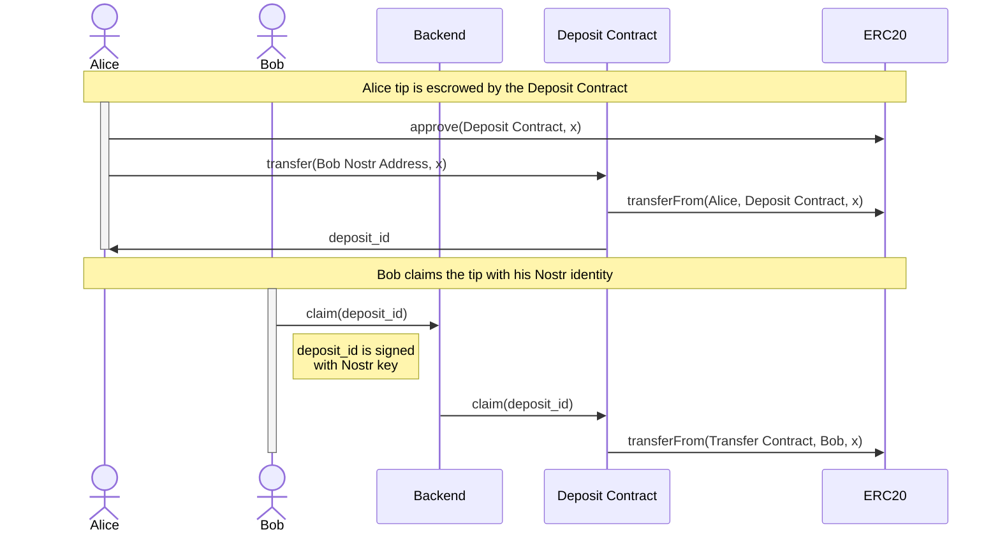
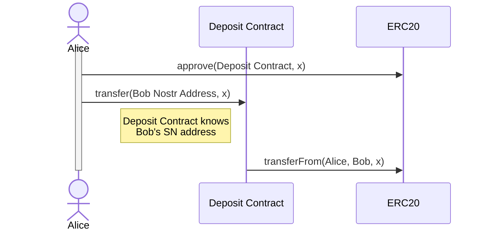
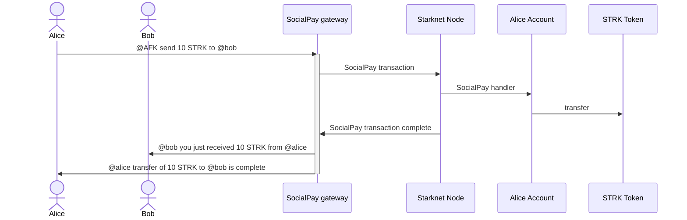

[](https://github.com/AFK-AlignedFamKernel/afk_monorepo/actions/workflows/starknet-contracts.yml)

[](https://reactnative.dev/)

</div>

[Website](https://www.afk-community/) | [Telegram](https://t.me/afk_aligned_fam_kernel) | [Twitter](https://x.com/AFK_AlignedFamK)

## Overview

Decentralized social built with Nostr and powered by Starknet account abstraction.

## Origin story

The name "Aligned Fam Kernel" is inspired by our vision to align the web3 family together, in one Social graph.

We build and fight together, not against. What if the treasure are the friends we made along the way? Then A decentralized social network should be a treasure trove of memories and connections!

Yes! This is what social networks should be about. A place where you can be yourself, express your thoughts and feelings, and connect with others.

Freedom requires censorship resistance, and Nostr provides exactly that.

## Contribute

Register to [Only Dust](https://onlydust.com/) to get rewarded for your contributions.

Tech stack:

- Starknet smart contracts in Cairo - [Learn Cairo now](https://book.cairo-lang.org/)
- React Native for the mobile app - [Learn React Native now](https://reactnative.dev/docs/tutorial)
- Typescript for the Nostr relayer - [Learn Typescript now](https://www.typescriptlang.org/docs/handbook/2/basic-types.html)

## Monorepo

We use Turborepo for the monorepo.

- Onchain (Cairo & Solidity): /onchain
- Scripts: Run & deploy Cairo code

Apps:

- Mobile: apps/mobile
- Website landing page: apps/website
- Backend: apps/data-backend
- Indexer Apibara: apps/indexer

Packages:

- Common: packages/common
- Prisma indexer pull: packages/indexer-prisma
- Nostr sdk: packages/afk_nostr_sdk

## Roadmap

### MVP

- [x] Cairo implementation of Nostr signature verification
- [x] Starknet account contract implementation, controlled by Nostr keypair
- [x] AFK landing page
- [x] SocialPay feature to send and receive tips through Nostr signed messages
- [x] Implement a Nostr client application with Starknet integration
- [x] Run Nostr relay server

### Now

- [ ] Complete Nostr client
- [ ] ZAP
- [ ] Launchpad & Pump it
- [ ] Questings
- [ ] Social games
- [ ] BTCFi and Bridge
- [ ] Onramp offramp
- [ ] Crossover with [Vault](https://github.com/keep-starknet-strange/vault) to bring Social features to the Vault application

## Architecture

### Tips

There are two alternatives: WalletConnect, one which expects Nostr users to set up oridinary Starknet wallet like Argent or Braavos, and so called SocialPay which uses custom Account Abstraction contract based on bip340 signature scheme (Nostr native).

#### Wallet Connect

##### Tip to a recipient that never accepted the tip and don't have an account on SN



##### Tip to a recipient that earlier accepted the tip



#### SocialPay

##### Alice sends tokens to Bob



## Modules

<details>
  <summary>Onchain</summary>

The onchain components of the project are implemented as a suite of Starknet smart contracts.

### Build

To build the project, run:

```bash
scarb build
```

### Test

To test the project, run:

```bash
snforge test
```

</details>

## Mobile

The AFK Mobile app is built with React-native & Expo.
[Current version](https://app.afk-community)

Pick an issue with the labels "mobile" to start work on React-native and contribute!

### Test

To test the mobile app, run:

```bash
cd apps/mobile
pnpm install
pnpm start
```

Select Expo web, Android or IOS. You can scan it with Expo GO on your phone.

## Resources

- [Starknet](https://starknet.io/)
- [Nostr](https://www.nostr.com/)
- [Nostr Implementation Possibilities](https://github.com/nostr-protocol/nips)
- [JoinStr: Decentralized CoinJoin Implementation Using Nostr](https://www.nobsbitcoin.com/joinstr-decentralized-coinjoin-implementation-using-nostr/)
- [Smart Vaults - Bitcoin multi-custody signature orchestration - website](https://www.smartvaults.io/)
- [Smart Vaults - Bitcoin multi-custody signature orchestration - repo](https://github.com/smartvaults/smartvaults)

## Fork

We build into the Joyboy repo here from the Exploration team:

[]

[![Exploration_Team](https://img.shields.io/badge/Exploration_Team-29296E.svg?&style=for-the-badge&logo=data:image/svg%2bxml;base64,PD94bWwgdmVyc2lvbj0iMS4wIiBlbmNvZGluZz0iVVRGLTgiPz48c3ZnIGlkPSJhIiB4bWxucz0iaHR0cDovL3d3dy53My5vcmcvMjAwMC9zdmciIHZpZXdCb3g9IjAgMCAxODEgMTgxIj48ZGVmcz48c3R5bGU+LmJ7ZmlsbDojZmZmO308L3N0eWxlPjwvZGVmcz48cGF0aCBjbGFzcz0iYiIgZD0iTTE3Ni43Niw4OC4xOGwtMzYtMzcuNDNjLTEuMzMtMS40OC0zLjQxLTIuMDQtNS4zMS0xLjQybC0xMC42MiwyLjk4LTEyLjk1LDMuNjNoLjc4YzUuMTQtNC41Nyw5LjktOS41NSwxNC4yNS0xNC44OSwxLjY4LTEuNjgsMS44MS0yLjcyLDAtNC4yN0w5Mi40NSwuNzZxLTEuOTQtMS4wNC00LjAxLC4xM2MtMTIuMDQsMTIuNDMtMjMuODMsMjQuNzQtMzYsMzcuNjktMS4yLDEuNDUtMS41LDMuNDQtLjc4LDUuMThsNC4yNywxNi41OGMwLDIuNzIsMS40Miw1LjU3LDIuMDcsOC4yOS00LjczLTUuNjEtOS43NC0xMC45Ny0xNS4wMi0xNi4wNi0xLjY4LTEuODEtMi41OS0xLjgxLTQuNCwwTDQuMzksODguMDVjLTEuNjgsMi4zMy0xLjgxLDIuMzMsMCw0LjUzbDM1Ljg3LDM3LjNjMS4zNiwxLjUzLDMuNSwyLjEsNS40NCwxLjQybDExLjQtMy4xMSwxMi45NS0zLjYzdi45MWMtNS4yOSw0LjE3LTEwLjIyLDguNzYtMTQuNzYsMTMuNzNxLTMuNjMsMi45OC0uNzgsNS4zMWwzMy40MSwzNC44NGMyLjIsMi4yLDIuOTgsMi4yLDUuMTgsMGwzNS40OC0zNy4xN2MxLjU5LTEuMzgsMi4xNi0zLjYsMS40Mi01LjU3LTEuNjgtNi4wOS0zLjI0LTEyLjMtNC43OS0xOC4zOS0uNzQtMi4yNy0xLjIyLTQuNjItMS40Mi02Ljk5LDQuMyw1LjkzLDkuMDcsMTEuNTIsMTQuMjUsMTYuNzEsMS42OCwxLjY4LDIuNzIsMS42OCw0LjQsMGwzNC4zMi0zNS43NHExLjU1LTEuODEsMC00LjAxWm0tNzIuMjYsMTUuMTVjLTMuMTEtLjc4LTYuMDktMS41NS05LjE5LTIuNTktMS43OC0uMzQtMy42MSwuMy00Ljc5LDEuNjhsLTEyLjk1LDEzLjg2Yy0uNzYsLjg1LTEuNDUsMS43Ni0yLjA3LDIuNzJoLS42NWMxLjMtNS4zMSwyLjcyLTEwLjYyLDQuMDEtMTUuOGwxLjY4LTYuNzNjLjg0LTIuMTgsLjE1LTQuNjUtMS42OC02LjA5bC0xMi45NS0xNC4xMmMtLjY0LS40NS0xLjE0LTEuMDgtMS40Mi0xLjgxbDE5LjA0LDUuMTgsMi41OSwuNzhjMi4wNCwuNzYsNC4zMywuMTQsNS43LTEuNTVsMTIuOTUtMTQuMzhzLjc4LTEuMDQsMS42OC0xLjE3Yy0xLjgxLDYuNi0yLjk4LDE0LjEyLTUuNDQsMjAuNDYtMS4wOCwyLjk2LS4wOCw2LjI4LDIuNDYsOC4xNiw0LjI3LDQuMTQsOC4yOSw4LjU1LDEyLjk1LDEyLjk1LDAsMCwxLjMsLjkxLDEuNDIsMi4wN2wtMTMuMzQtMy42M1oiLz48L3N2Zz4=)](https://github.com/keep-starknet-strange)

AFK Aligned Fam Kernel is born from this open source project.

Now we keep building and move forward!

## Contributors ✨

Thanks goes to these wonderful people ([emoji key](https://allcontributors.org/docs/en/emoji-key)):

<!-- ALL-CONTRIBUTORS-LIST:START - Do not remove or modify this section -->
<!-- prettier-ignore-start -->
<!-- markdownlint-disable -->
<table>
  <tbody>
    <tr>
      <td align="center" valign="top" width="14.28%"><a href="https://github.com/MSghais"><br /><sub><b>MSG</b></sub></a><br /><a href="https://github.com/AFK-AlignedFamKernel/afk_monorepo/commits?author=MSghais" title="Documentation">📖</a></td>
      <td align="center" valign="top" width="14.28%"><a href="https://github.com/addegbenga"><br /><sub><b>Adeyemi Gbenga</b></sub></a><br /><a href="https://github.com/AFK-AlignedFamKernel/afk_monorepo/commits?author=addegbenga" title="Code">💻</a></td>
      <td align="center" valign="top" width="14.28%"><a href="https://github.com/BlackStarkGoku"><br /><sub><b>BlackStarkGoku</b></sub></a><br /><a href="https://github.com/AFK-AlignedFamKernel/afk_monorepo/commits?author=BlackStarkGoku" title="Code">💻</a></td>
      <td align="center" valign="top" width="14.28%"><a href="https://github.com/Ayoazeez26"><br /><sub><b>Abdulhakeem Abdulazeez Ayodeji</b></sub></a><br /><a href="https://github.com/AFK-AlignedFamKernel/afk_monorepo/commits?author=Ayoazeez26" title="Code">💻</a></td>
      <td align="center" valign="top" width="14.28%"><a href="https://fishonsnote.medium.com/"><br /><sub><b>Fishon Amos</b></sub></a><br /><a href="https://github.com/AFK-AlignedFamKernel/afk_monorepo/commits?author=fishonamos" title="Code">💻</a></td>
      <td align="center" valign="top" width="14.28%"><a href="https://github.com/lindsaymoralesb"><br /><sub><b>Lindsay Morales</b></sub></a><br /><a href="https://github.com/AFK-AlignedFamKernel/afk_monorepo/commits?author=lindsaymoralesb" title="Code">💻</a></td>
      <td align="center" valign="top" width="14.28%"><a href="https://nnaji-benjamin-portfolio.vercel.app/"><br /><sub><b>Nnaji Benjamin</b></sub></a><br /><a href="https://github.com/AFK-AlignedFamKernel/afk_monorepo/commits?author=Benjtalkshow" title="Code">💻</a></td>
    </tr>
    <tr>
      <td align="center" valign="top" width="14.28%"><a href="https://github.com/bhavyagosai"><br /><sub><b>Bhavya Gosai</b></sub></a><br /><a href="https://github.com/AFK-AlignedFamKernel/afk_monorepo/commits?author=bhavyagosai" title="Code">💻</a></td>
      <td align="center" valign="top" width="14.28%"><a href="https://github.com/manlikeHB"><br /><sub><b>Yusuf Habib</b></sub></a><br /><a href="https://github.com/AFK-AlignedFamKernel/afk_monorepo/commits?author=manlikeHB" title="Code">💻</a></td>
      <td align="center" valign="top" width="14.28%"><a href="https://isaaconyemaechi.tech/"><br /><sub><b>Isaac Onyemaechi Ugwu</b></sub></a><br /><a href="https://github.com/AFK-AlignedFamKernel/afk_monorepo/commits?author=Dprof-in-tech" title="Code">💻</a></td>
      <td align="center" valign="top" width="14.28%"><a href="https://github.com/EjembiEmmanuel"><br /><sub><b>Oche</b></sub></a><br /><a href="https://github.com/AFK-AlignedFamKernel/afk_monorepo/commits?author=EjembiEmmanuel" title="Code">💻</a></td>
      <td align="center" valign="top" width="14.28%"><a href="https://poulav.vercel.app/"><br /><sub><b>Poulav Bhowmick</b></sub></a><br /><a href="https://github.com/AFK-AlignedFamKernel/afk_monorepo/commits?author=PoulavBhowmick03" title="Code">💻</a></td>
      <td align="center" valign="top" width="14.28%"><a href="https://github.com/lauchaves"><br /><sub><b>Lau Chaves</b></sub></a><br /><a href="https://github.com/AFK-AlignedFamKernel/afk_monorepo/commits?author=lauchaves" title="Code">💻</a></td>
    </tr>
  </tbody>
  <tfoot>
    <tr>
      <td align="center" size="13px" colspan="7">
        
          <a href="https://all-contributors.js.org/docs/en/bot/usage">Add your contributions</a>
        </img>
      </td>
    </tr>
  </tfoot>
</table>

<!-- markdownlint-restore -->
<!-- prettier-ignore-end -->

<!-- ALL-CONTRIBUTORS-LIST:END -->

This project follows the [all-contributors](https://github.com/all-contributors/all-contributors) specification. Contributions of any kind welcome!
