# Livestream User Flow Diagrams

## Overview

This document provides comprehensive user flow diagrams and explanations for the AFK livestream system, covering both broadcaster and viewer experiences.

## 1. Broadcaster Flow (Host Studio)

### 1.1 Initial Setup Flow

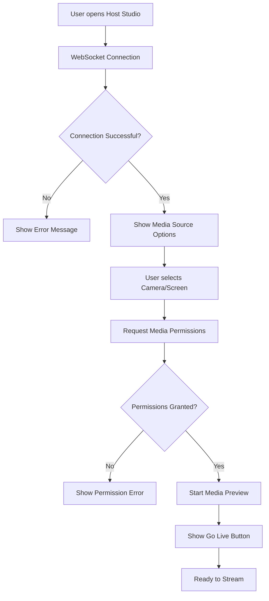

### 1.2 Going Live Flow

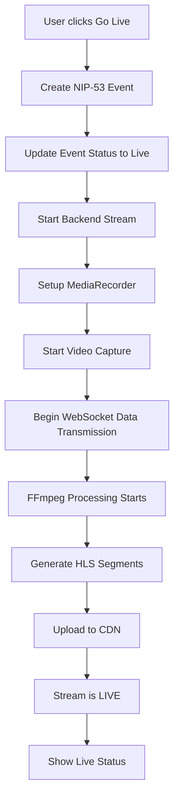

### 1.3 Stream Management Flow

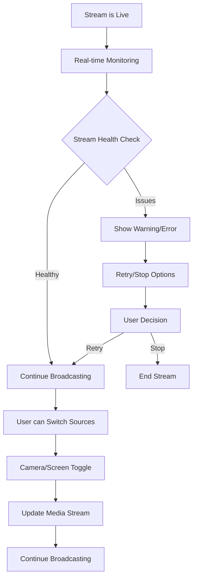

### 1.4 Ending Stream Flow

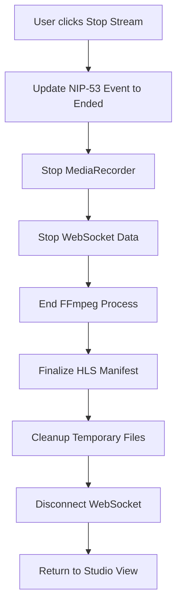

## 2. Viewer Flow

### 2.1 Discovery and Access Flow

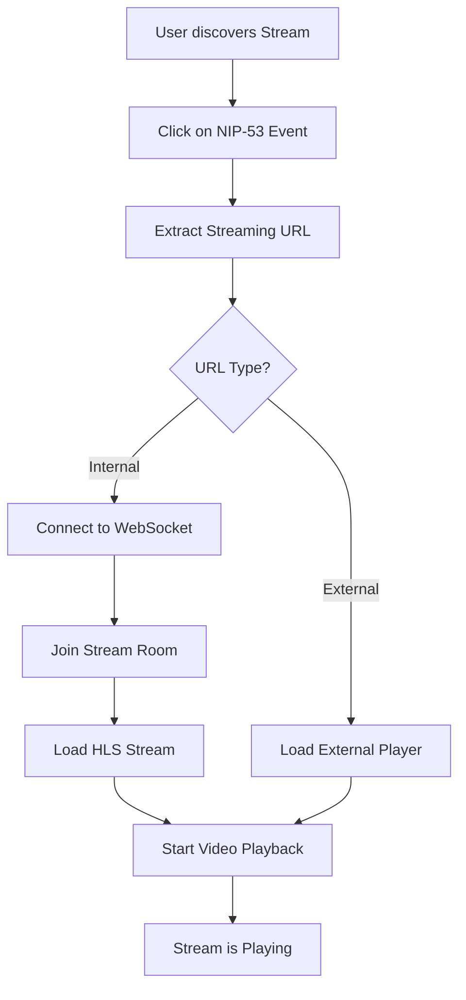

### 2.2 Stream Loading Flow

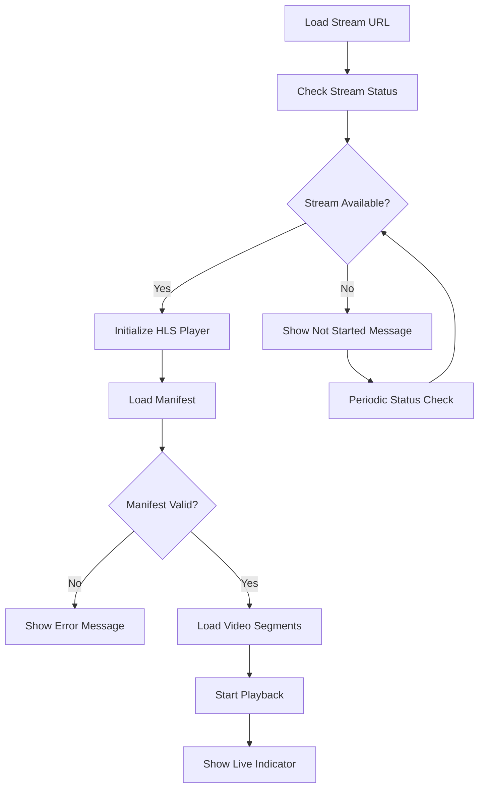

### 2.3 Real-time Updates Flow

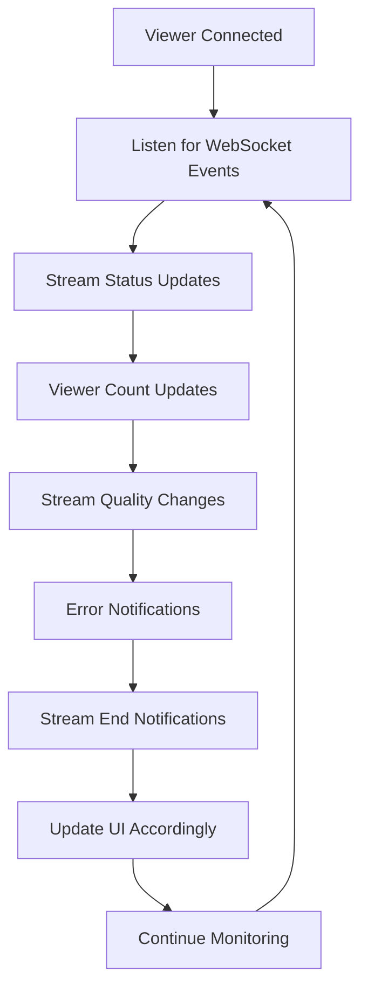

## 3. System Integration Flow

### 3.1 NIP-53 Event Integration

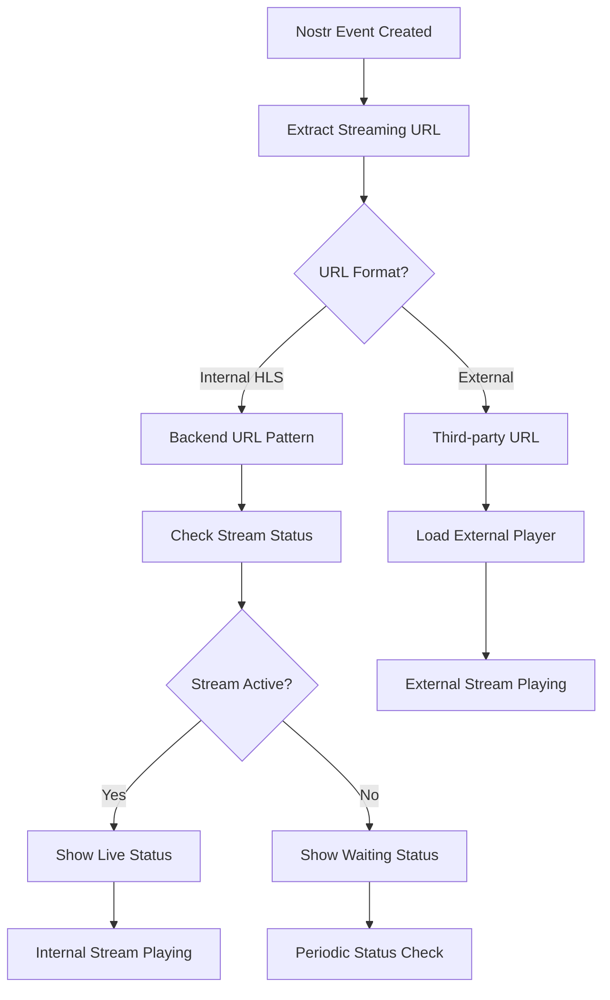

### 3.2 Error Recovery Flow

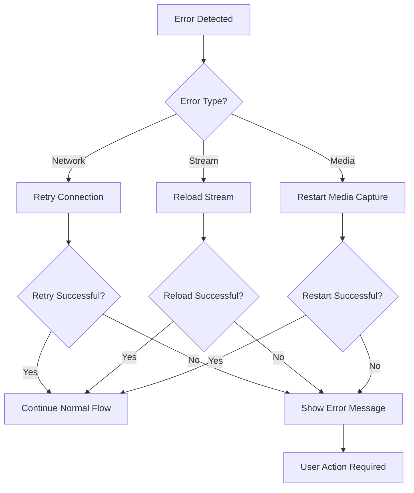

## 4. Technical Flow Diagrams

### 4.1 WebSocket Data Flow

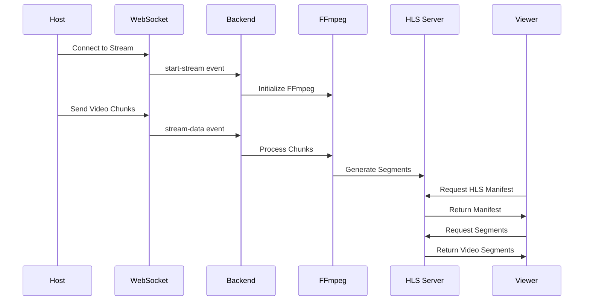

### 4.2 HLS Generation Flow

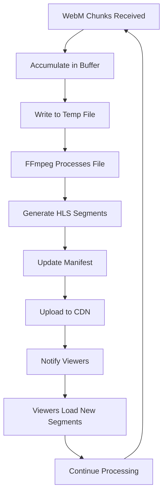

## 5. User Experience States

### 5.1 Broadcaster States

| State | Description | UI Elements | Actions Available |
|-------|-------------|-------------|-------------------|
| **Idle** | Initial state, no connection | Connect button, instructions | Connect to stream |
| **Connecting** | Establishing WebSocket connection | Loading spinner, status | Wait for connection |
| **Connected** | WebSocket connected, ready to stream | Media source buttons, Go Live | Select camera/screen, Go Live |
| **Streaming** | Actively broadcasting | Live indicator, Stop button | Stop stream, switch sources |
| **Error** | Connection or stream error | Error message, retry button | Retry connection, go back |

### 5.2 Viewer States

| State | Description | UI Elements | Actions Available |
|-------|-------------|-------------|-------------------|
| **Loading** | Checking stream status | Loading spinner | Wait for status |
| **Not Started** | Stream exists but not broadcasting | Waiting message, refresh | Refresh status |
| **Ready** | Stream ready, waiting for content | Ready message | Wait for content |
| **Live** | Stream is broadcasting | Video player, live indicator | Play controls, chat |
| **Error** | Stream error or unavailable | Error message, retry | Retry, refresh page |

## 6. Error Scenarios and Recovery

### 6.1 Common Error Scenarios

#### Network Errors
- **WebSocket disconnection**: Automatic reconnection with exponential backoff
- **HTTP request failures**: Retry with increasing delays
- **Stream timeout**: Show appropriate message and retry options

#### Media Errors
- **Camera access denied**: Show permission request and fallback options
- **Microphone issues**: Mute/unmute controls and error notifications
- **Screen sharing denied**: Fallback to camera or show instructions

#### Stream Errors
- **HLS manifest errors**: Reload stream and show status
- **Segment loading failures**: Retry loading with backoff
- **FFmpeg processing errors**: Restart stream or show error message

### 6.2 Recovery Strategies

#### Automatic Recovery
- WebSocket reconnection
- Stream status polling
- HLS player retry logic
- MediaRecorder restart

#### User-Initiated Recovery
- Manual refresh buttons
- Stream restart options
- Source switching
- Page reload

## 7. Performance Considerations

### 7.1 Latency Optimization
- **WebSocket**: Real-time data transmission
- **HLS**: 2-second segments for low latency
- **FFmpeg**: Veryfast preset for quick processing
- **CDN**: Global distribution for reduced latency

### 7.2 Bandwidth Management
- **Adaptive bitrate**: Multiple quality levels
- **Chunk optimization**: Efficient data transmission
- **Compression**: WebM encoding for smaller chunks
- **Caching**: CDN caching for repeated requests

### 7.3 Resource Management
- **Memory**: Efficient chunk processing
- **CPU**: Optimized FFmpeg settings
- **Storage**: Automatic cleanup of temporary files
- **Connections**: Proper WebSocket lifecycle management

## 8. Accessibility Considerations

### 8.1 Keyboard Navigation
- Tab navigation through controls
- Enter/Space for button activation
- Arrow keys for volume/seek controls
- Escape for fullscreen exit

### 8.2 Screen Reader Support
- ARIA labels for all interactive elements
- Status announcements for stream changes
- Error message announcements
- Live region updates for dynamic content

### 8.3 Visual Accessibility
- High contrast mode support
- Scalable UI elements
- Clear status indicators
- Error message visibility

## 9. Mobile Considerations

### 9.1 Touch Interface
- Large touch targets for controls
- Swipe gestures for navigation
- Touch-friendly video controls
- Responsive layout adaptation

### 9.2 Performance
- Optimized for mobile bandwidth
- Battery usage considerations
- Memory management
- Network condition handling

### 9.3 Platform Integration
- Native camera integration
- Screen sharing limitations
- Notification support
- Background processing limits
